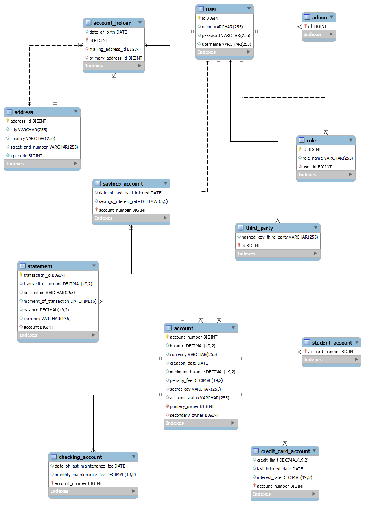

#TimeBank API

This program simulates, in a very basic way, an API for a virtual Bank, **TimeBank**.

The database used is H2, both for the main application and for tests, but it could easily be implemented in more
"persistent" dabase systems, like MySQL. H2 was chosen because of the lack of "prework" necessary to run the demonstration
program. 

Please run the `TimeBankApiProjectApplication` main to start the app. Routes can be tested and used with 
the help of Postman.

All existing passwords and hashKeys are the raw password "password" encrypted, for ease of testing.

Below are all routes created, and when applicable, the configuration of the JSON payload
to be used in a particular request.

Savings and Card Account interests, and other periodic fees are credited/debited 
with a Scheduled routine, defined in the class `ScheduledTasks`, in the `utils` package.
These would take place every day at 2:00AM. The crono definition in the `@Scheduled` annotation can be 
changed for testing.

The fraud detection mechanisms are implemented in the `FraudDetection` class, in the `utils` package.

Please enjoy.

## Routes for ADMIN profile users

###GET: /admin

###GET: /admin/users/{id}

###POST: /admin/users/accountholders
- "name": String,
- "username": String,
- "password": String,
- "dateOfBirth": LocalDate (yyyy-MM-dd),
- "primaryAddressId": Long,
- "mailingAddressId": Long (optional)

###GET: /admin/accounts/accountholders/primaryowners/{primaryOwner}

###GET: /admin/accounts/accountholders/{id}

###POST: /admin/accounts/checkingaccounts
- "primaryOwnerId": Long,
- "secondaryOwnerId": Long (optional),
- "secretKey": String

###POST: /admin/accounts/savings
- "primaryOwnerId": Long,
- "secondaryOwnerId": Long (optional),
- "secretKey": String,
- "minimumBalance": BigDecimal (optional. x >= 100. If present, savingInterestRate must be defined),
- "savingInterestRate": BigDecimal (optional. 0 < x < 0.5. If present, minimumBalance must be defined)

###POST: /admin/accounts/creditcardaccounts
- "primaryOwnerId": Long,
- "secondaryOwnerId": Long (optional),
- "secretKey": String,
- "creditCardInterestRate": BigDecimal (optional. x >= 0.1. If present, creditLimit must be defined),
- "creditLimit": BigDecimal (optional. 0 < x < 100000. If present, creditCardInterestRate must be defined)

###GET: /admin/accounts/balances/{accountNumber}

###PATCH: /admin/accounts/balances/{accountNumber}
- "balance": BigDecimal

###POST: /admin/addresses
- "streetAndNumber": String,
- "zipCode": Long (max 10 digits),
- "city": String,
- "country": String

###GET: /admin/addresses/{id}

###POST: /admin/thirdparties
- "name": String,
- "username": String,
- "password": String,
- "hashedKey": String (encrypted)

##Routes for ACCOUNTHOLDER profile users

###GET: /accountholders

###GET: /accountholders/accounts

###GET: /accountholders/accounts/balance/{accountNumber}

###PATCH: /accountholders/transfers
- "originAccountNumber": Long,
- "beneficiaryAccountNumber": Long,
- "beneficiaryName": String (minimum 3 chars),
- "amount": BigDecimal (positive)

##Routes for THIRDPARTY profile users

###PATCH: /thirdparty/transactions
- "account": Long,
- "amount": BigDecimal,
- "accountSecretKey": String (encrypted. rawPassword must be the same as rawPassword of account)

##Class Relations Diagram

